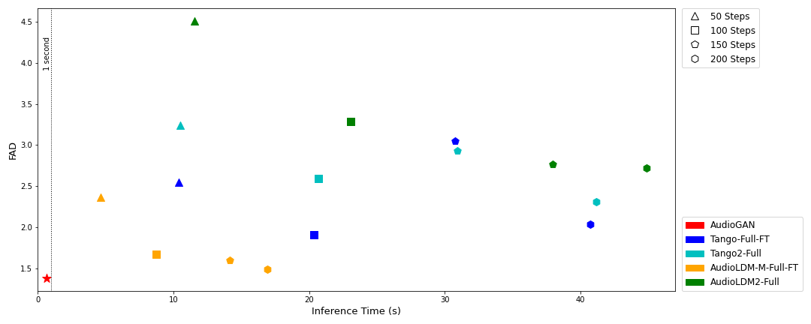

  <h1>AudioGAN: A Compact and Efficient Framework for Real-Time High-Fidelity Text-to-Audio Generation</h1>
  <!-- <a href=>Paper</a> | <a href="https://meanaudio.github.io/">Webpage</a>  -->

  

## Overview 
AudioGAN is a novel GAN-based model tailored for compact and efficient text-to-audio generation.

  

